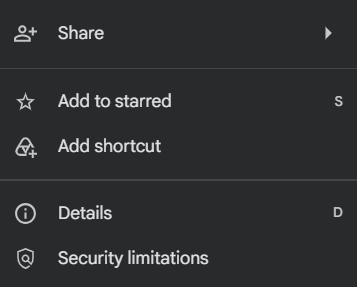
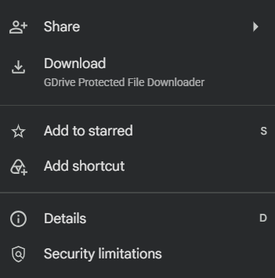

# GDrive Protected File Downloader

A Chrome extension that adds a download button to Google Drive files when the normal **Download** option is disabled. It does not remove permissions or bypass account restrictions.

|                             Before                              |                             After                             |
| :-------------------------------------------------------------: | :-----------------------------------------------------------: |
|  |  |
|               **Original Google Drive File menu**               |              **File menu using this extension**               |

The extension adds a **Download** entry directly to the existing Google Drive menu. The added item uses the surrounding Drive menu styling and includes the extension name beneath it.

## Features

- Adds a **Download** button when Google Drive’s normal download option is disabled
- Saves **view-only PDF** and **video** files as downloadable files
- Processes PDF pages and video streams **locally in the browser**
- Detects available video resolutions via the Drive player’s **Settings → Quality** menu
- Runs as a standard Chrome extension (Manifest V3)

## How does it work?

When the extension detects that downloading is disabled and that the file type is supported, it adds a custom download button to the Google Drive interface and processes the content according to its file type.

### PDF

The extension captures each page as it is rendered in the Google Drive viewer (one sequential pass), then builds a downloadable PDF from those page images.

### Video

Google Drive often serves video and audio as separate streams. The extension detects those streams, downloads them, and merges them into a single MP4 using **mp4-remux** (a small pure-JS remuxer that copies streams as-is, similar in idea to `ffmpeg -c copy`).

Support for additional file types is currently unplanned.

## Install

1. Download or unpack this extension folder.
2. Open `chrome://extensions`.
3. Enable **Developer mode**.
4. Click **Load unpacked** and select the extension folder.

## Usage

1. Open a view-only PDF or video on Google Drive.
2. Open the **File** menu.
3. Choose the extension’s **Download** item.
4. Follow the on-screen overlay (capture / quality picker / progress).

For files opened through Google Classroom, use **File → Open → Open in new tab** first, then use the Google Drive **File** menu.

**Note:** While quality detection runs, the page is dimmed and a small overlay is shown (with Cancel). Interaction is restored when the quality picker is ready.

## Limitations

- PDF quality depends on the resolution Google Drive renders in the viewer.
- Large files can use significant memory and take longer to process.
- Video quality is limited to the streams and resolutions Drive actually exposes.
- Changes to Google Drive’s player, viewer, or network behavior may break compatibility.
- Leaving the PDF viewer tab mid-capture can still interrupt page capture.

## Credits

### Workflow references

- **[salauddinn/gdrive-video-downloader](https://github.com/salauddinn/gdrive-video-downloader)** — reference for the Google Drive video download flow (separate video/audio streams).
- **[zavierferodova/Google-Drive-View-Only-PDF-Script-Downloader](https://github.com/zavierferodova/Google-Drive-View-Only-PDF-Script-Downloader)** — reference for the view-only PDF capture workflow.
  - **[mhsohan/How-to-download-protected-view-only-files-from-google-drive-](https://github.com/mhsohan/How-to-download-protected-view-only-files-from-google-drive-)**
  - **[zeltox/Google-Drive-PDF-Downloader](https://github.com/zeltox/Google-Drive-PDF-Downloader)**

### Bundled library

- **[mp4-remux](https://github.com/mscststs/mp4-remux)** — tiny pure-JS tool used to merge separate video and audio MP4 streams without re-encoding.

Please refer to those projects for their licenses, source, and notices.

## Disclaimer

- This project was built with assistance from AI tools during development, debugging, refactoring, and documentation.
- It does not remove access restrictions, bypass authentication, or grant access to files the user cannot already view.
- Do not use this extension to circumvent access controls, permissions, copyright, or other restrictions set by the file owner.
- You are responsible for complying with Google Drive’s Terms of Service and applicable law.

This project is provided as-is.
